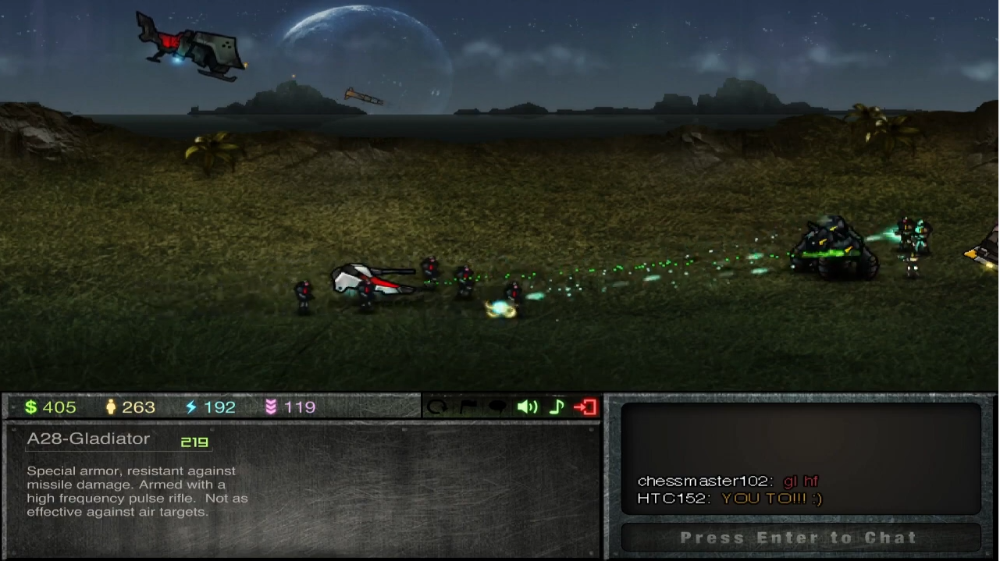
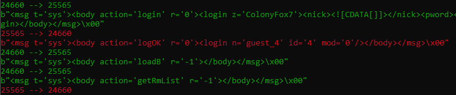

# Colony-Server
Back-end server created from scratch for an old RTS flash game called Colony.



## Project Info
Colony is an old multiplayer flash game, its source code was lost long ago, and the server shut down.

With the assistance of the lovely fan community of the game and permission from the author,the back-end server was reversed engineered for them to play with each other again.
The project involved working with ActionScript3, XML, and Python.

Development involves inspecting decompiled code of the client and listening to network packets sent by the client (See [Packet Inspector](tools/packet_inspector.py)).



## Community Contact Info
### Colony Discord: https://discord.gg/rP8nhm8

## Docker Deployment

Colony-Server includes complete Docker support for easy deployment and consistent runtime environments. This is the recommended way to run the server in production.

### Prerequisites

Before you begin, ensure you have the following installed:

- **Docker** (version 20.10 or higher) - [Installation Guide](https://docs.docker.com/get-docker/)
- **Docker Compose** (version 2.0 or higher) - [Installation Guide](https://docs.docker.com/compose/install/)

### Quick Start Guide

Follow these steps to get Colony-Server running with Docker:

1. **Clone the repository** (if you haven't already):
   ```bash
   git clone <repository-url>
   cd Colony-Server
   ```

2. **Create your environment file**:
   ```bash
   cp .env.example .env
   ```

3. **Configure your Discord bot token**:
   
   Edit the `.env` file and replace `your_discord_bot_token_here` with your actual Discord bot token:
   ```bash
   DISCORD_API=your_actual_discord_bot_token
   ```
   
   Get your Discord bot token from the [Discord Developer Portal](https://discord.com/developers/applications).

4. **Build and start the server**:
   ```bash
   docker-compose up -d
   ```
   
   The `-d` flag runs the container in detached mode (background).

5. **View server logs**:
   ```bash
   docker-compose logs -f
   ```
   
   Press `Ctrl+C` to stop following logs.

Your Colony-Server should now be running on port **25565**!

### Docker Compose Commands

Here are the essential commands for managing your Colony-Server with Docker Compose:

```bash
# Start the server (detached mode)
docker-compose up -d

# Stop the server
docker-compose down

# View logs (follow mode)
docker-compose logs -f

# View logs (last 100 lines)
docker-compose logs --tail=100

# Rebuild and restart after making changes
docker-compose up -d --build

# Restart the server
docker-compose restart

# Check server status
docker-compose ps

# Stop and remove everything including volumes (⚠️ DELETES DATA!)
docker-compose down -v
```

### Manual Docker Commands

If you prefer to use Docker without Compose:

```bash
# Build the image
docker build -t colony-server .

# Run the container
docker run -d \
  --name colony-server \
  -p 25565:25565 \
  -v colony-data:/app/data \
  -v $(pwd)/config.ini:/app/config.ini:ro \
  --env-file .env \
  --restart unless-stopped \
  colony-server

# Stop the container
docker stop colony-server

# Start the container
docker start colony-server

# Remove the container
docker rm colony-server

# View logs
docker logs -f colony-server

# View last 100 log lines
docker logs --tail=100 colony-server
```

### Configuration

#### config.ini

The [`config.ini`](config.ini:1) file is mounted as **read-only** into the container. To modify server configuration:

1. Edit the `config.ini` file on your host machine
2. Restart the container for changes to take effect:
   ```bash
   docker-compose restart
   ```

Available configuration options in [`config.ini`](config.ini:1):
- **version**: Game client version (default: 175)
- **address**: Server bind address (default: 0.0.0.0)
- **port**: Server port (default: 25565)
- **database path**: SQLite database location (default: data/server.db)
- **logging level**: Log verbosity (default: info)
- **moderators**: List of moderator usernames
- **welcome message**: Message shown to connecting players

#### Environment Variables

Environment variables are managed through the `.env` file:

- **DISCORD_API** (required): Your Discord bot token
- **PORT** (optional): Override the default port 25565
- **LOG_LEVEL** (optional): Application log level

### Data Persistence

Colony-Server uses a Docker named volume called `colony-data` to persist the SQLite database across container restarts and updates.

#### Backing Up Your Database

To backup your database:

```bash
# Create a backup directory
mkdir -p backups

# Copy database from the volume
docker run --rm \
  -v colony-data:/data \
  -v $(pwd)/backups:/backup \
  alpine \
  cp /data/server.db /backup/server-backup-$(date +%Y%m%d-%H%M%S).db
```

#### Inspecting Volume Data

To inspect the contents of the data volume:

```bash
# List files in the volume
docker run --rm -v colony-data:/data alpine ls -lah /data

# Open a shell in the volume
docker run --rm -it -v colony-data:/data alpine sh
```

#### Restoring from Backup

To restore a database backup:

```bash
# Stop the server first
docker-compose down

# Restore the database
docker run --rm \
  -v colony-data:/data \
  -v $(pwd)/backups:/backup \
  alpine \
  cp /backup/server-backup-YYYYMMDD-HHMMSS.db /data/server.db

# Start the server
docker-compose up -d
```

#### ⚠️ Important Warning

**DO NOT** use `docker-compose down -v` unless you want to delete all persistent data! The `-v` flag removes volumes, which will permanently delete your database.

### Port Information

By default, Colony-Server listens on port **25565**. This is configured in both [`config.ini`](config.ini:1) and [`docker-compose.yml`](docker-compose.yml:1).

#### Changing the Port

To change the server port:

1. **Edit [`docker-compose.yml`](docker-compose.yml:1)**:
   ```yaml
   ports:
     - "YOUR_PORT:25565"  # Change YOUR_PORT to desired port
   ```

2. **Optionally, edit [`config.ini`](config.ini:1)** if you want to change the internal port:
   ```ini
   [connection]
   port = YOUR_PORT
   ```

3. **Restart the server**:
   ```bash
   docker-compose up -d --build
   ```

### Troubleshooting

#### Common Issues and Solutions

**Issue: Container won't start**

Check the logs for errors:
```bash
docker-compose logs
```

**Issue: Port already in use**

Check if another process is using port 25565:
```bash
# Linux/Mac
sudo lsof -i :25565

# Windows
netstat -ano | findstr :25565
```

Stop the conflicting process or change Colony-Server's port mapping.

**Issue: Permission denied errors**

The container runs as a non-root user (UID 1000). Ensure your volumes have appropriate permissions:
```bash
sudo chown -R 1000:1000 ./data
```

**Issue: Database connection errors**

Verify the data volume is properly mounted:
```bash
docker inspect colony-server | grep -A 10 Mounts
```

#### Health Check Status

Check the container's health status:
```bash
# Detailed health information
docker inspect colony-server | grep -A 10 Health

# Quick status check
docker ps
```

A healthy server should show `healthy` in the STATUS column.

#### Viewing Container Logs

Different ways to view logs:

```bash
# Follow logs in real-time
docker-compose logs -f

# View last 50 lines
docker-compose logs --tail=50

# View logs with timestamps
docker-compose logs -t

# View logs for a specific time period
docker-compose logs --since 30m
```

#### Container Not Responding

If the container appears frozen:

```bash
# Check if the process is running
docker exec colony-server ps aux

# Restart the container
docker-compose restart

# Force restart if needed
docker-compose stop
docker-compose up -d
```

### Production Recommendations

For production deployments, consider the following best practices:

#### 1. Security

- **Never commit `.env` to version control** - It contains sensitive tokens
- Use strong, unique Discord bot tokens
- Consider using Docker secrets for sensitive data in production
- Regularly update the base image for security patches

#### 2. Backups

Set up automated backups using a cron job:

```bash
# Add to crontab (crontab -e)
0 2 * * * docker run --rm -v colony-data:/data -v /path/to/backups:/backup alpine cp /data/server.db /backup/server-backup-$(date +\%Y\%m\%d).db
```

#### 3. Resource Limits

The [`docker-compose.yml`](docker-compose.yml:1) includes resource limits:
- CPU limit: 2.0 cores (max)
- Memory limit: 2GB (max)
- CPU reservation: 0.5 cores (guaranteed)
- Memory reservation: 512MB (guaranteed)

Adjust these based on your server load and available resources.

#### 4. Logging

Log rotation is already configured in [`docker-compose.yml`](docker-compose.yml:1):
- Maximum log file size: 10MB
- Maximum log files: 3
- Logs are stored in JSON format

#### 5. Monitoring

Consider setting up monitoring for:
- Container health status
- Resource usage (CPU, memory)
- Log analysis for errors
- Database size growth

#### 6. Updates

To update to a newer version:

```bash
# Pull latest changes
git pull

# Rebuild and restart
docker-compose up -d --build

# Verify health
docker-compose ps
```

#### 7. Network Security

If exposing to the internet:
- Use a reverse proxy (nginx, Traefik) with rate limiting
- Implement DDoS protection
- Consider using a VPN for administrative access
- Monitor connection logs for suspicious activity